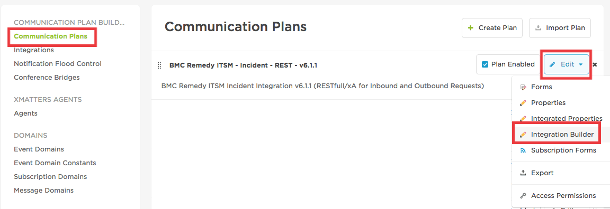
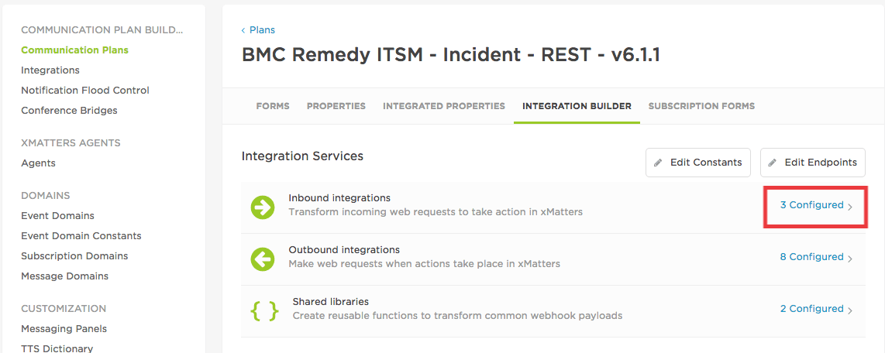
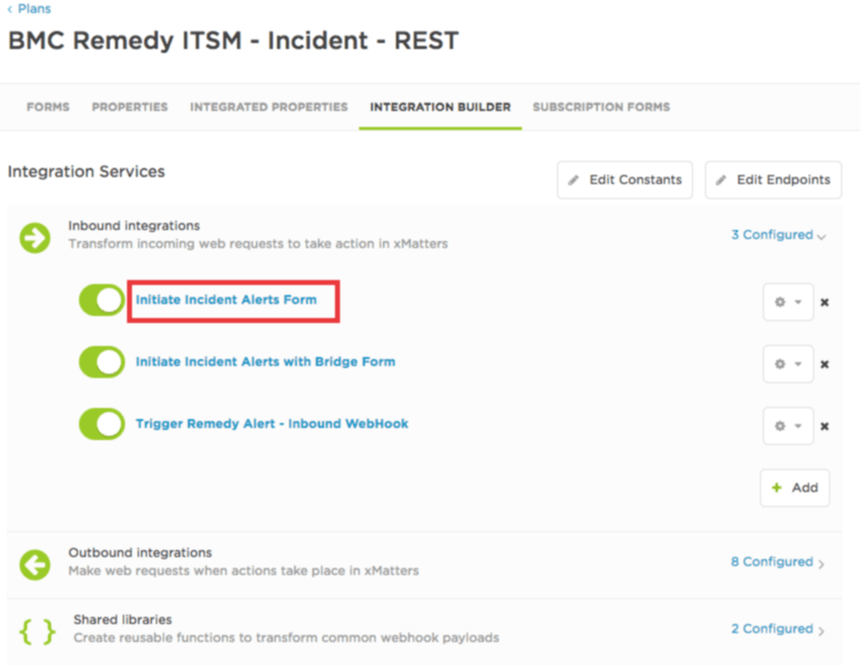
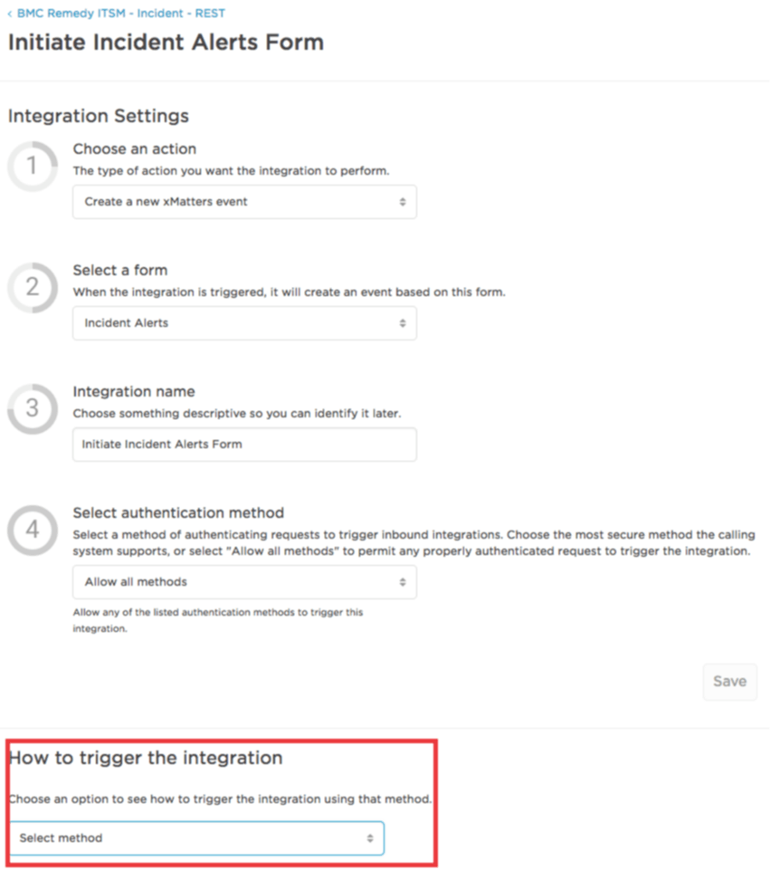
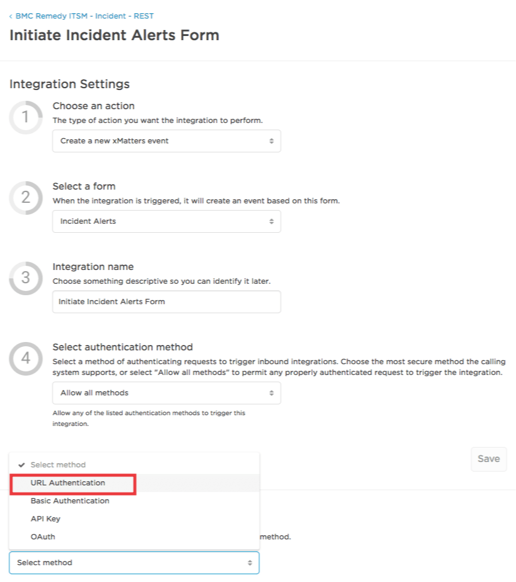
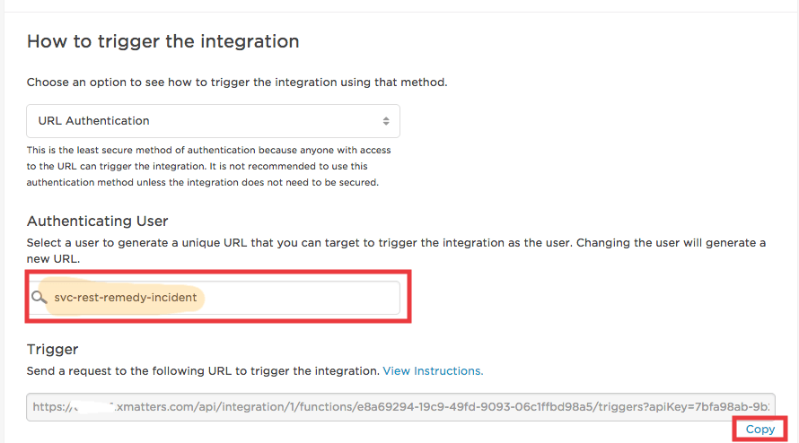

# BMC Remedy 9 via REST
Notify on-call response teams when critical incidents are reported in Remedy. With the xMatters and BMC Remedy closed-loop integration, the on-call members of resolver teams are automatically notified via multiple communication channels. When the recipient responds, notes are added to the incident work log and specific incident actions may take place depending on the response.

---------

<kbd>
  
</kbd>

---------

# Table of Contents
1. [Pre-Requisites](#Pre-Requisites)
2. [Files](#Files)
3. [How it works](#how)
4. [Installation](#inst)
	1. [Verify Agents are Running](#agrun)
	2. [xMatters Agent Additional Setup](#xaset)
		1. [Create a REST User](#crest)
	3. [Integration Agent Setup](#xaset)
		1. [Create a REST User](#crest)
	4. [xMatters On-Demand Setup](#xset)
		1. [Create a REST User](#crest)
		2. [Import the Communication Plan](#icp)
		3. [Assign permissions to the Communication Plan and Form](#acpf)
		4. [Configure List Property Values](#clpv)
		5. [Configure Integration Builder Endpoints](#cibe)
		6. [Configure Integration Builder Constants](#cibc)
		7. [Configure REMEDY\_FORM\_INFO and REMEDY\_FORM\_CRITERIA](#crfirfc)
	5. [Remedy set up](#rsu)
		1. [Importing workflow definition files](#riwdf)
		2. [Configuring filters](#rcf)
		3. [Configuring ITSM user](#rciu)
		4. [Disabling automatic assignment](#rdaa)
5. [Testing](#test)
6. [Troubleshooting](#tshoot)

***

# Pre-Requisites
* Version 9.1 and above of Remedy (on-prem, or on-demand via VPN)
* Account in Remedy capable of making REST calls
* xMatters account - If you don't have one, [get one](https://www.xmatters.com)!
* The following xMatters components *MUST* be installed on a server (or VM) on-premises (your data center, or a VM in the cloud) that has the ability to connect to both your xMatters instance, and your Remedy instance.<br>
*THIS MUST BE DONE BEFORE ANY OTHER INSTALLATION ACTIVITIES*
 * xMatters Agent (for communications back to Remedy from xMatters)
     * Overall information about the xMatters Agent is [here](https://help.xmatters.com/ondemand/xmodwelcome/xmattersagent/xmatters-agent-topic.htm)
     * Installation instructions for the xMatters Agent is [here](https://help.xmatters.com/ondemand/xmodwelcome/xmattersagent/install-xmatters-agent.htm)  
 * xMatters Integration Agent (for communications to xMatters from Remedy)
     * Overall information about the xMatters Integration Agent is [here](https://help.xmatters.com/ondemand/iaguide/integration-agent-overview.htm)
     * Installation instructions for the xMatters Integration Agent is [here](https://help.xmatters.com/ondemand/iaguide/integration-agent.htm)
     * You will also need to
         * Request an `Integration Agent ID` from Support as part of the installation of the xMatters Integration Agent.
         * Add a Web Service User (see the section called "Create a web service user" on [this](https://help.xmatters.com/ondemand/iaguide/integration-agent.htm) page)
         * Update the default Integration Service listening port:<br>
             * Open up the installed Integration Agent's `<IAHome>\conf\IAConfig.xml` file and change the `service-gateway` listening port from it's default `8081` to something else (e.g. `8181`), as this will conflict with the default listening he listening port that the xMatters Agent is configured on as part of it's out-of-the-box configuration.
             * Alternatively, you can change the default listener port for the xMatters Agent by setting a Windows Environment variable called `SERVER_PORT` to something other than `8081`.
             * Be sure to restart either the Integeation Agent or the xMatters Agent depending on where you decide to make that change.

# Files
The following are the files that makeup the Remedy 9 Incident integration.  Each of these are installed and configured into a combination of Remedy, the Agents, and your xMatters On-Demand instance.  The [Installation](#Inst) section covers this in detail.

* [xMattersAgent.zip](xMattersAgent.zip) - Supplemental files for completing the xMatters Agent configuration.
* [IntegrationAgent.zip](IntegrationAgent.zip) - The Remedy Incident Integration Service and configuration files to be installed on the configured Integration Agent.
* [xMattersOnDemand/BMCRemedyITSMIncidentREST.zip](xMattersOnDemand/BMCRemedyITSMIncidentREST.zip) - Remedy Incident Communication Plan (ready to be configured).
* [Remedy.zip](Remedy.zip) - This zip file containing the BMC Remedy 8.1 and above workflow definition files.

# <a name="how"></a>How it works
### Information Workflow
The following diagram illustrates a standard workflow in an incident management system, and how information from the management system is passed into xMatters:
<kbd>
  
</kbd>
### Integration Workflow
Remedy triggers one of the xMatters filters as part of the integration. The filter POSTs the Remedy Incident ID to xMatters via SOAP (a Remedy limitation), and in turn xMatters uses a Remedy REST web service call to obtain the incident properties and subsequently creates the xMatters Event targeted to the assigned resolver Group.

The notified resolver responds with ACCEPT - to take ownership of the incident, IGNORE - to escalate to the next resource in the on call schedule, COMMENT to add an independent Work Info note, or RESOLVE - to resolve the incident.

The closed loop integration annotates the incident's Work Info log with xMatters event status, notification delivery status, annotations/comments, and user responses. Additionally, an ACCEPT response assigns the user to the incident and updates the incident status to In Progress. A RESOLVE response updates the incident status to Resolved.

<kbd>
This diagram shows the relationship and data flow between the components for a typical Incident process:

  
</kbd>
Additional details may be found in the previous SOAP-based on premise Integration Guide for BMC Remedy Incident [here](media/xM-BMC-Remedy_Incident_Management_5_1_2.pdf).

# <a name="inst"></a>Installation 

## <a name="agrun"></a>1. Verify Agents are Running
Before doing any installation steps for this Remedy Incident integration, it is critical to make sure that your xMatters Agent and Integration Agent are running and visible in your environment.<br>
To view the state of the running agents, you need to login to your xMatters instance, and go to the `DEVELOPER` section.<br>
On the left hand context menu, click on `Agents` (directly underneath `XMATTERS AGENTS`).<br>
The default view on the right is called `AVAILABLE`, you need to click on the next linke `INSTALLED`
<kbd>
  
</kbd>
<br>
After clicking `INSTALLED`, you should see a list of agents.<br>
Click on the "Connected" filter in the upper right side of the display, and you should at least see one connected (green and white checkmark under STATUS) `xMatters Agent` in the upper list, and one connected `Integration Agent` in the lower list.<br>
Here's an example:
<kbd>
  
</kbd>


## <a name="xaset"></a>2. xMatters Agent Additional Setup
The integration expects to work with encrypted passwords (see the description of `REMEDY_WS_PASSWORD` in [Configure Integration Builder Constants](#cibc) below).<br>
In order for the system to decrypt that value, a special library (.jar file) needs to be added to the xMatters Agent installation.<br>
The following steps will guide you in adding this library:

1. Download the file [xMattersAgent.zip](xMattersAgent.zip) to the server where your xMatters Agent is installed and running.
2. Unzip the file into a temporary directory (e.g. C:\temp).  Check out [this article](https://support.microsoft.com/en-gb/help/4028088/windows-zip-and-unzip-files) if you need help with unzipping compressed files in Windows.
The following images show an example of what you should find if you performed those operations in your C:\temp folder.
<kbd>
  
</kbd>
<kbd>
  
</kbd>
<kbd>
  
</kbd>
3. Move (or copy) the `EncryptionUtils.jar` file to the `applib` folder of your xMatters Agent installation.  Typically this will be `C:\Program Files\xa\applib`.
<kbd>
  
</kbd>
4. Update the existing xerus-service.conf (`C:\Program Files\xa\config\xerus-service.conf`) file to refer to the new EncryptionUtils.jar file.<br>We have included a filed called `xerus-servcie.conf.additions` that is an example of the change you need to make to `xerus-service.conf`.
<kbd>
  
</kbd>
When you open the `xerus-service.conf` file, you will want to find the last occurance of a line beginning with `wrapper.java.classpath.nn` where `.nn` is going to be a number like 29 as the example shows here.

	```
wrapper.java.classpath.29=${wrapper.working.dir}\\service-installer\\lib\\xercesImpl-2.9.1.jar
```
Paste the two lines from `xerus-service.conf.additions` directly after the last occurance of the line starting with `wrapper.java.classpath.nn`, and make sure that the new line has a number that is one more than the previous line.  So, if the last occurance you find is `.29`, than make the new line that refers to `EncryptionUtils.jar` have `.30`.

	```
# Include the xMatters Encryption utility claseses
wrapper.java.classpath.30=${wrapper.working.dir}\\applib\\EncryptionUtils.jar
```
Here's an example of `xerus-service.conf` after the change has been made. `DON'T FORGET TO SAVE THIS FILE AFTER MAKING YOUR CHANGES!`
<kbd>
  
</kbd>
5. Once you have saved the changes, the last step is to restart the xMatters Agent.  This is done from the Services applet.
<kbd>
  
</kbd>


## <a name="xset"></a>xMatters Setup
### <a name="crest"></a>Create a REST user account

<kbd>
  
</kbd>  

### <a name="icp"></a>Import the Communication Plan
* Import the "BMC Remedy ITSM - Incident - REST" Communication Plan [BMCRemedyITSMIncidentREST.zip](BMCRemedyITSMIncidentREST.zip).
Instructions on Importing Communication Plans are [here](http://help.xmatters.com/OnDemand/xmodwelcome/communicationplanbuilder/exportcommplan.htm).

### <a name="apcpf"></a>Assign permissions to the Communication Plan and Form  
* On the Communication Plans page, click the Edit drop-down menu for the "BMC Remedy ITSM - Incident - REST" Communication Plan then select Access Permissions
* Add the REST User
* On the Communication Plans page, click the Edit drop-down menu for the "BMC Remedy ITSM - Incident - REST" Communication Plan then select Forms
* Click the Mobile and Web Service drop-down menu for the Incident Alerts form
* Select Sender Permissions then add the REST User

### <a name="clpv"></a>Configure List Property Values  
* On the Communication Plans page, click the Edit drop-down menu for the "BMC Remedy ITSM - Incident - REST" Communication Plan then select Properties
* Verify/Edit the following list property values:  
   Company  
   Contact\_Sensitivity  
   Escalated  
   Impact  
   Priority  
   Reported\_Source  
   SLM_Status  
   Service\_Type  
   Status  
   Status\_Reason  
   Urgency  
   VIP

### <a name="cibe"></a>Configure Integration Builder Endpoints  
* On the Communication Plans page, click the Edit drop-down menu for the "BMC Remedy ITSM - Incident - REST" Communication Plan then select Integration Builder
* Click the "Edit Endpoints" button
* For the `xMatters` endpoint, in Assign Endpoint add the REST User from above (e.g. svc-rest-remedy-incident), then Save Changes
* For the `RemedyRESTAPI` endpoint, type the Base URL for the Remedy environment's REST Web Service address (e.g. https://remedyServer:8443) then Save Changes
* Close Edit Endpoints  

### <a name="cibc"></a>Configure Integration Builder Constants  
Note: There are many Constants defined in the Communication Plan (and described below), but only the ones that are environment specific need to be configured.  Those will have an asterisk (*) in front of their name.

* On the Communication Plans page, click the Edit drop-down menu for the "BMC Remedy ITSM - Incident - REST" Communication Plan then select Integration Builder
* Click the "Edit Constants" button
* Edit these constants to match your environment (used by the scripts in the Communication Plan, and the "Remedy Rest Util" Shared Library)
   
| Constant               | Description                                                                |
|:---------------------- |:-------------------------------------------------------------------------- |
| `* REMEDY_FORM_CRITERIA` | JSON Array containing objects with property values that when matched cause a particular form to be used. (This object is dependent on the constant `REMEDY_FORM_INFO`.  See specific configuration instructions for both below). |
| `* REMEDY_FORM_INFO` | JSON Object representing the FORMs in this Comm Plan, their name and trigger URL. (This values in this object are used by the constant `REMEDY_FORM_CRITERIA`.  See specific configuration instructions for both below). |
| `* REMEDY_FQDN` | The fully qualified domain name AND port of the Remedy Mid Tier server that provides the Remedy Web User Interface.  Typically this is on port 8080. |
| `* REMEDY_SERVER_NAME` | The logical server name to target in Remedy. |
| `* REMEDY_WS_PASSWORD` | The Remedy API user's encrypted password.<br>Note: This is created using the xMatters Integration Agent's iapassword.bat utility.  See the instruction [here](https://help.xmatters.com/ondemand/iaguide/iapasswordutility.htm).  Once the file is created, open it up in any text editor and paste the contents into this value. |
| `* REMEDY_WS_USERNAME` | Login ID of the Remedy User that will be making API calls. |

* Review these constants used by the scripts in the Communication Plan, and the "Remedy Rest Util" Shared Library.  They all have default values that are suitable for getting started.
   
| Constant               | Description                                                                |
|:---------------------- |:-------------------------------------------------------------------------- |
| `REMEDY_ENDPOINT` | The name of the xMatters endpoint object to use for calls to Remedy (default is "RemedyRESTAPI"). |
| `REMEDY_NOTE_PREFIX` | Text that is placed in-front of all Work Notes (default is "[xMatters] -"). |
| `REMEDY_OPT_ADD_JSON_HEADER` | If true, include the "Conent-Type: application/json" HTTP request header.<br>Note: This should be false if scripts are running in the xMatters Agent (default is false). |
| `REMEDY_OPT_MOCK_ENABLED [OPTIONAL]` | If exists, and the value is true, then export the mocked functions and variables. |
| `REMEDY_OPT_SIMPLE_GROUP_NAME` | If true, construct the xMatters target group name as just whatever value is in "Assigned_Group" vs. concatonating all Support Group name qualifiers "Support Company\*Support Organization\*Assigned\_Group" .  For example, "Desktop Support" vs "Calbro Services\*IT Support\*Desktop Support". (The default is true.)|
| `REMEDY_RESOLVED_RESOLUTION` | Description set in the Resolution field when the "Resolve" Response Option is taken. (Default is "Ticket resolved via xMatters notification response".) |
| `REMEDY_RESOLVED_RESOLUTION_METHOD` | Method set in the Resolution Method field when the "Resolve" Response Option is taken. (Default is "Self-Service".) |
| `REMEDY_STATUS_IN_PROGRESS` | Value put into the Status field upon Accept (default is "In Progress", but must map to a value that is configured in your Remedy instance). |
| `REMEDY_STATUS_REASON` | Value entered into the Status_Reason field upon Resolution (default is "No Further Action Required"). |
| `REMEDY_STATUS_RESOLVED` | Value put into the Status field upon Resolution (default is "Resolved", but must map to a value that is configured in your Remedy instance). |
| `RESPONSE_ACTION_ACCEPT` | Response Option representing Accept (default is "accept"). |
| `RESPONSE_ACTION_ACK` | Response Option representing Acknowledgement (short) (default is "ack"). |
| `RESPONSE_ACTION_ACKNOWLEDGE` | Response Option representing Acknowledgement (full) (default is "acknowledge"). |
| `RESPONSE_ACTION_ANNOTATE` | Response Option representing Annotate (same result as comment) (default is "annotate"). |
| `RESPONSE_ACTION_COMMENT` | Response Option representing Comment (default is "comment"). |
| `RESPONSE_ACTION_IGNORE` | Response Option representing Ignore (Escalate) (default is "ignore"). |
| `RESPONSE_ACTION_JOIN` | Response Option representing Join (Conference Bridge Only) (default is "join"). |
| `RESPONSE_ACTION_RESOLVE` | Response Option representing Resolve/Resolution (default is "resolve"). |


### <a name="crfirfc"></a>Configure REMEDY\_FORM\_INFO and REMEDY\_FORM\_CRITERIA
The ability to choose and route incoming requests from Remedy to a particular Form based on the need (or not) for a Conference Bridge is performed dynamically at by the Inbound Integration and controlled by two constants: `REMEDY_FORM_INFO` and `REMEDY_FORM_CRITERIA`.

#### Configure REMEDY\_FORM\_INFO
`REMEDY_FORM_INFO` is used to hold the information on the Forms and their Inbound Integration entry points.  The out-of-the-box configuration contains two Forms ("Incident Alerts", and "Incident Alerts with Bridge") that have corresponding Inbound Integration entry points/web hooks ("Initiate Incident Alerts Form", and "Initiate Incident Alerts with Bridge Form" respectively).
The contents of this constant is a JSON (JavaScript Object Notation) array of objects, each representing information about one of these Forms.
Each element has a particular format and fields.  The only two fields of each element that you will need to configure are the `"triggerURL"` and `"URLUser"` fields.  They represent the Inbound Integration address and the user that will be authenticating to call that trigger.
Here is the out-of-the-box, unconfigured version of `REMEDY_FORM_INFO`.

```javascript
[
  {
    "pos": 0,
    "planName": "BMC Remedy ITSM - Incident - REST",
    "formName": "Incident Alerts",
    "userResponseOptions":"Accept,Comment,Resolve",
    "groupResponseOptions":"Accept,Ignore,Comment,Resolve",
    "triggerURL": "<TO-BE-FILLED-IN-BASED-ON-INBOUND-INTEGRATION>",
    "URLUser": "<YOUR-XMATTERS-REMEDY-REST-USER>"
  },
  {
    "pos": 1,
    "planName": "BMC Remedy ITSM - Incident - REST",
    "formName": "Incident Alerts with Bridge",
    "userResponseOptions":"Accept,Join,Comment,Resolve",
    "groupResponseOptions":"Accept,Ignore,Join,Comment,Resolve",
    "triggerURL": "<TO-BE-FILLED-IN-BASED-ON-INBOUND-INTEGRATION>",
    "URLUser": "<YOUR-XMATTERS-REMEDY-REST-USER>"
  }
]
```

The value to put into `"URLUser"` is simply the xMatters User ID for the REST User that you created previously (e.g. "svc-rest-remedy-incident").

Here is how we lookup the values to put into the "triggerURL":

* On the Communication Plans page, click the Edit drop-down menu for the "BMC Remedy ITSM - Incident - REST" communication plan then select Integration Builder

* Click the *3 Configured* link (blue text) to the right of Inbound Integrations

* Click the *Initiate Incident Alerts Form* link (blue text)

* Scroll to the **How to trigger the integration** section

* Select "URL Authentication" for the method

* Find the REST User you created above and select in Authenticating User, then click the *Copy Url* link

* Once we have the URL, we want to past everything starting with `/api...` into the `"triggerURL"` field for the `"pos":0` element.
   * We do this by editing the Constant like so: 
    
* Now, do the same thing for the "Initiate Incident Alerts with Bridge Form" Inbound Integration, and update the `"pos":`` element.
* Be sure to click the "Save Changes" button.
* When you are done, you're `REMEDY_FORM_INFO` should contain something like this:


```javascript
[
  {
    "pos": 0,
    "planName": "BMC Remedy ITSM - Incident - REST",
    "formName": "Incident Alerts",
    "userResponseOptions":"Accept,Comment,Resolve",
    "groupResponseOptions":"Accept,Ignore,Comment,Resolve",
     "triggerURL": "/api/integration/1/functions/e8a69294-19c9-49fd-9093-06c1ffbd98a5/triggers?apiKey=7bfa98ab-9b2f-45d2-9361-c49c95c026ad",
    "URLUser": "svc-rest-remedy-incident"
  },
  {
    "pos": 1,
    "planName": "BMC Remedy ITSM - Incident - REST",
    "formName": "Incident Alerts with Bridge",
    "userResponseOptions":"Accept,Join,Comment,Resolve",
    "groupResponseOptions":"Accept,Ignore,Join,Comment,Resolve",
    "triggerURL": "/api/integration/1/functions/c7a99c60-ab67-48cc-94a6-24167e51afe5/triggers?apiKey=20888305-ed7e-4fc7-b5a6-6aa861a84c7f",
    "URLUser": "svc-rest-remedy-incident"
  }
]
```
#### Configure REMEDY\_FORM\_CRITERIA
`REMEDY_FORM_CRITERIA` is used to decide at runtime what Form to initiate based on the value(s) of any named properties that are coming in from Remedy.  It relies on the information from `REMEDY_FORM_INFO` to know how to initiate a given Form by referencing the position of the specific form in the Array.

By default, an occurance of `"form":0` refers to the "Incident Alerts" Form, and an occurance of `"form":1` refers to the "Incident Alerts with Bridge" Form.

You do not have to modify `REMEDY_FORM_CRITERIA` if the out-of-the-box behavior works for you.

The default configuration operates as follows:

	* If the values from Remedy for
   		* `"impact"` is `"1-Extensive/Widespread"`, and 
    	* `"urgency"` is `"1-Critical"`, and 
    	* `"priority"` is `"Critical"`
    	
	* Then, initiate "Incident Alerts with Bridge" Form, and start a new xMatters Conference Bridge.
	
	* All other combinations will result in the non-bridge "Incident Alerts" Form.

Here is what the out-of-the-box contents of `REMEDY_FORM_CRITERIA` looks like:

```javascript
[
    {
        "defaultForm":0,
        "hasBridge":false
    },
    {
        "properties":{
            "impact":"1-Extensive/Widespread",
            "urgency":"1-Critical",
            "priority":"Critical"
            },
        "form":1,
        "hasBridge":true,
        "type":"BRIDGE",
        "useExisting":false,
        "existingEventPropFieldName":"",
        "existingEventValueFieldName":""
    },
    {
        "properties":{
            "impact":"1-Extensive/Widespread",
            "urgency":"2-High",
            "priority":"Critical"
            },
        "form":0,
        "hasBridge":false
    },
    {
        "properties":{
            "impact":"2-Significant/Large",
            "urgency":"1-Critical",
            "priority":"High"
            },
        "form":0,
        "hasBridge":false
    },
    {
        "properties":{
            "impact":"2-Significant/Large",
            "urgency":"2-High",
            "priority":"High"
            },
        "form":0,
        "hasBridge":false
    },
    {
        "properties":{
            "impact":"3-Moderate/Limited",
            "urgency":"1-Critical",
            "priority":"High"
            },
        "form":0,
        "hasBridge":false
    },
    {
        "properties":{
            "impact":"3-Moderate/Limited",
            "urgency":"2-High",
            "priority":"High"
            },
        "form":0,
        "hasBridge":false
    }
]
```

It basically says to use Form 0 as the default Form to use if nothing matches the definitions that follow.

The next six (6) elements define which Form to select for a variety of combinations of properites coming in from Remedy.

If you want to add or modify the existing elements, the field definitions are as follows:

* Element 0: Represents the default form, so has a special `"defaultForm"` field, whereas all other Elements use the field named `"form"` to determine which element of the `REMEDY_FORM_INFO` array to reference.
* Other than that, all elements are able to use the following fields:
 
| Field               | Description                                                                |
|:---------------------- |:-------------------------------------------------------------------------- |
| `"properties"` | (Required: object) A JavaScript Object that contains one or more field names and values.  The field name(s) (left of the colon in quotes) represent the name of fields that are being sent to xMatters from the Remedy Incident, and the values (right of the colon) are what to match agains.  If all of the values coming from Remedy match the values defined here, then choose the form identified in the "form" field. |
| `"form"` | (Required: number) Represents the subscript into the `REMEDY_FORM_INFO` array to decide which Form to trigger.  A value of zero (0) refers to the first element in the array. |
| `"hasBridge"` | (Required: boolean, `true` or `false`) A flag that determines if a Conference Bridge is on the Form.  A value of `true` means that the Form has a Conference Bridge defined on it's Layout, and a value of `false` means that the Form does not contain a Conference Bridge Defined on it's layout. |
| `"type"` | (Required if `"hasBridge"` is `true`, must be `"BRIDGE"` or `"EXTERNAL"`)  If a conference bridge is required, then we need to know if we are configuring an xMatters Hosted Bridge (`"BRIDGE"`), or an External Bridge (`"EXTERNAL"`).  See [this](https://help.xmatters.com/ondemand/userguide/conferencebridging/create-conference-bridge.htm) page for information on creating Conference Bridges. |
| `"subType"` | (Required if `"type"` is `"EXTERNAL"`, and must be `"STATIC"` or `"DYNAMIC"`)  This identifies it the externally defined bridge information has a Bridge Number defined in it's definition (`"STATIC"`), or if thte Bridge Number is to be specified at run-time (`"DYNAMIC"`) |
| `"bridgeId"` | (Required if `"type"` is `"EXTERNAL"`) Name of pre-defined 3rd-party Conference Bridge object (e.g. "My Skype Priority 1 Bridge"). |
| `"bridgeNumber"` | (Required if `"subType"` is `"DYNAMIC"`, string) Digits representing bridge number (e.g. "13849348". |
| `"dialAfter"` | (Optional: string) digits or characters to dial after the bridgeNumber (e.g. "#" or ",,,#", etc). |
| `"useExisting"` | (Optional: boolean, `true` or `false`)  If present and `"hasBridge"` is `true`, then you can specify values for `"existingEventPropFieldName "` and `"existingEventValueFieldName"` to allow the script to lookup the information related to an exissting/running Conference Bridge. |
| `"existingEventPropFieldName"` | (Optional: string)  If present and `"useExisting"` is `true`, then you can specify either `"eventId"` or the name of a property in the incoming payload from Remedy to get the Event Id for an existing event that will contain the running Conference Bridges details. |
| `"existingEventValueFieldName"` | (Optional: string)  If present and `"useExisting"` is `true`, then you use this field to specify the name of the field that can be used to lookup the running Event.<br>If `"existingEventPropFieldName"` = `eventId`, then the contents of the field named in `"existingEventValueFieldName"` will be an active xMatters Event Id.<br>Othewise, `"existingEventPropFieldName"` is the name of a Property in a running xMatters Event, and `"existingEventValueFieldName"` is the value to campare it to.<br>For example, `"existingEventPropFieldName"` may be "Incident ID" (the name of a Property in the Event to search for), and `"existingEventValueFieldName"` may be "incident_number" which will contain a Remedy Incident Number at runtime to search with (i.e. value of "incident_number" will match the value of "Incident ID" if found). |

Here's another way of thinking about how and when to specify the Conference Bridge details:

```
    hasBridge: {boolean} true | false
    
        IF "hasBridge" is true
        
            useExisting: {boolean} true | false
            
            type: {string} "EXTERNAL" | "BRIDGE"
            
                IF "EXTERNAL"
                    subType: {string} "STATIC" | "DYNAMIC"
                    bridgeId: {string} "Name of pre-defined 3rd-party Conference Bridge object"
                    IF "subType" is "DYNAMIC"
                        bridgeNumber: {string} "digits representing bridge number"
                    dialAfter: {string} (Optional) "digits or characters to dial after the bridgeNumber"
                        
                IF "BRIDGE"
                    No other properties are required.
                    IF "useExisting" is true
                        bridgeId: Will be resolved at run-time
                        
                IF "useExisting" is true
                    existingEventPropFieldName: {string} "eventId" | "<arbitrary-event-property-name>"
                    existingEventValueFieldName: {string} "<field-name-in-source-properties-with-existingEventPropFieldName-value>"
```

	
## <a name="rsu"></a>Remedy set up
Configuring BMC Remedy to integrate with xMatters requires the following steps:

* Import the workflow definition files
* Configure filters
* Configure the ITSM user
* Disable automatic assignments

### <a name="riwdf"></a>Importing workflow definition files
* BMC's instructions are [here](https://docs.bmc.com/docs/ars91/en/importing-object-definitions-609072836.html)
* Copy the [Remedy.zip](Remedy.zip) file to the machine that has the BMC Remedy Developer Studio installed on it.
* Unzip the file which should expand our two Remedy Incident Workflow definition files ([xm_foumdation\_8\_1.def](Remedy/xm_foundation_8_1.def), and [xm_incident\_8\_1.def](Remedy/xm_incident_8_1.def))
* Log in to the BMC Remedy Developer Studio, and then select **File** > **Import**
* Select **BMC Remedy Developer Studio** > **Object Definitions**, and then click **Next**
* Select the AR System server into which you want to upload the integration objects, and then click **Next**
* Do one of the following:  
      Type in the location of the `xm_foundation_8_1.def` file  
      Click the Browse button to the right of the text field and navigate to the location of the `xm_foundation_8_1.def` file. Select the file, and then click **Open**.  
* Click **Next**  
      If you have already imported a workflow definition file, ensure that you select the Replace Objects on the Destination Server check box (do not select the other check boxes), but note that any changes you have made to those objects will be lost. If you are sure the changes you made are necessary for your installation, you will be required to re-apply those changes to the new version of the files being imported unless you applied those changes to overlay objects.  
* Repeat the above steps to import the `xm_incident_8_1.def` file.  
      Note this file must be imported after the foundation file.  
Click **Finish**

### <a name="rcf"></a>Configuring filters
The integration includes a filter and an escalation that use the Set Fields action to consume a web service; these objects need their endpoints changed to the address of the integration agent.  E.g. http://<integration-agent-server-ip>:<service_port>/http/applications_bmc_remedy_9_incident_6_0_1
Filter: XM:EI:EventInjection_100  
Escalation: XM:Event Injection Retry

### <a name="rciu"></a>Configuring ITSM user
The integration requires a dedicated ITSM user to interact with incidents.

#### Create an ITSM user
First, create a new ITSM user with the Incident Master role in BMC Remedy; the user does not need to be Support Staff.

<kbd>
  
</kbd>

**Note: If you specify a Login ID of "xmatters" for this ITSM user, you can skip the following two update steps.**

#### Update the filter qualification
The XM:Incident_Re-Assigned_899 filter contains the following qualification criteria: `($USER$ != "xmatters")`  

This qualification prevents the integration from sending a second notification based on an incident's assignment changing because of a user response to an earlier notification. Replace `xmatters` with the name of the ITSM user created in Step One.

<kbd>
  
</kbd>

#### Update the default assignee
The out-of-box permissions allow the Submitter and Assignee (and BMC Remedy administrators) to search instances of the XM:Event Injection form. This allows users who modify incidents to see the corresponding XM:Event Injection instance for their update. To allow the ITSM user to also see all the Event Injection forms, modify the default value for the Assigned To field to the ITSM user you created.  

<kbd>
  
</kbd>

### <a name="rdaa"></a>Disabling automatic assignment
To allow xMatters to control assignments, you must turn off the automatic assignment feature in BMC Remedy.

**Note: To perform this step, you will need to login as a user with Administrator permission.**

* Log in to the BMC Remedy Mid Tier web server.
* Click **Applications**, and then click the **Application Console** left-menu item.
* Click **Application Administration Console**.
* In the new window, expand **Incident Management**, and then expand **Advanced Options**.
* Select **Rules**, and then click **Open**.
* Search for all existing "Configure Incident Rules".
* For each existing rule, do the following:  
      Select the rule, and in the **Assignment Process** drop-down list, select **(clear)**.  
      Click **Save**.  


# <a name="test"></a>Testing

## Triggering a notification
To trigger a notification, create a new incident with a priority of High or Critical in BMC Remedy, and assign it to
a user or group that exists in both BMC Remedy and xMatters:  

<kbd>
  
</kbd>

## Responding to a notification
In the following example, the notification is received on an Apple iPhone, but the process is similar for all devices.  

* Notifications appear in the application Inbox  

<kbd>
  
</kbd>  

* Opening the notification displays the details  

<kbd>
  
</kbd>  

* After viewing the details, either click the respond (blue return arrow) icon at the top or scroll to the bottom of the notification  

<kbd>
  
</kbd>  

* Tap the desired response, then tap **Respond now** or **Respond with comment**  

<kbd>
  
</kbd>  


# <a name="tshoot"></a>Troubleshooting
If an xMatters notification was not received you can work backwards to determine where the issue may be:  
* Review the xMatters Reports tab and the specific [Event Log](http://help.xmatters.com/OnDemand/installadmin/reporting/eventlogreport.htm)  
* If no Event was created, review the [xMatters Inbound Integration Activity Stream](http://help.xmatters.com/OnDemand/xmodwelcome/integrationbuilder/activity-stream.htm)  
* If no activity was recorded, review the Remedy logs for a POST to xMatters
* If you see that Remedy POSTed to xmatters, next, inspect the logs from the Integration Agent that is listening for those requesets. (Search for "Exception", as well as "202" to detect if the integration was submitted to xMatters.